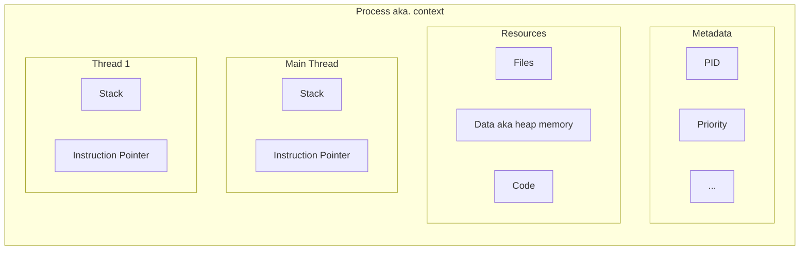
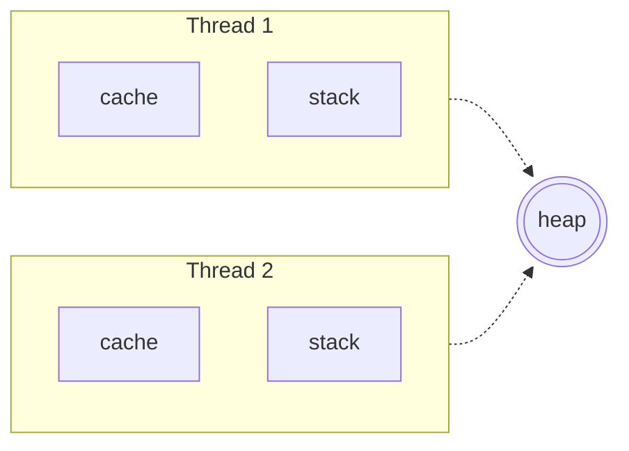
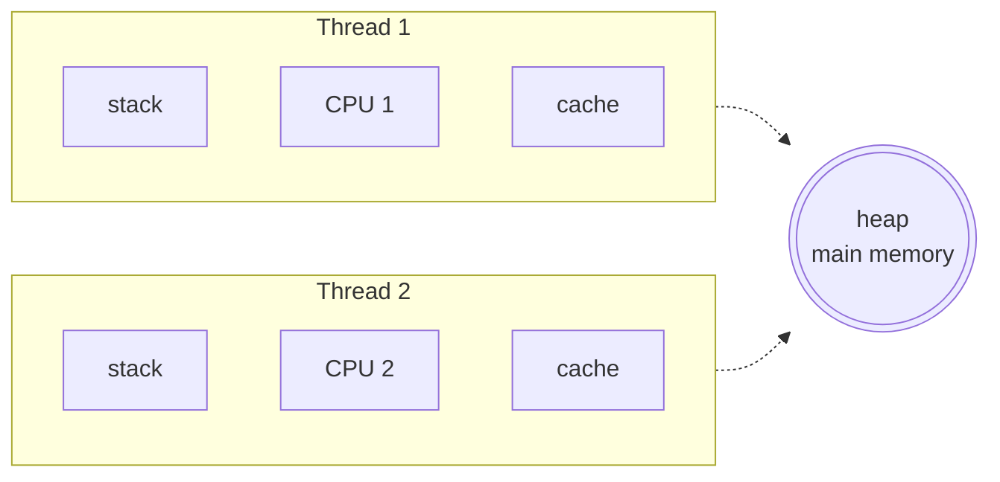
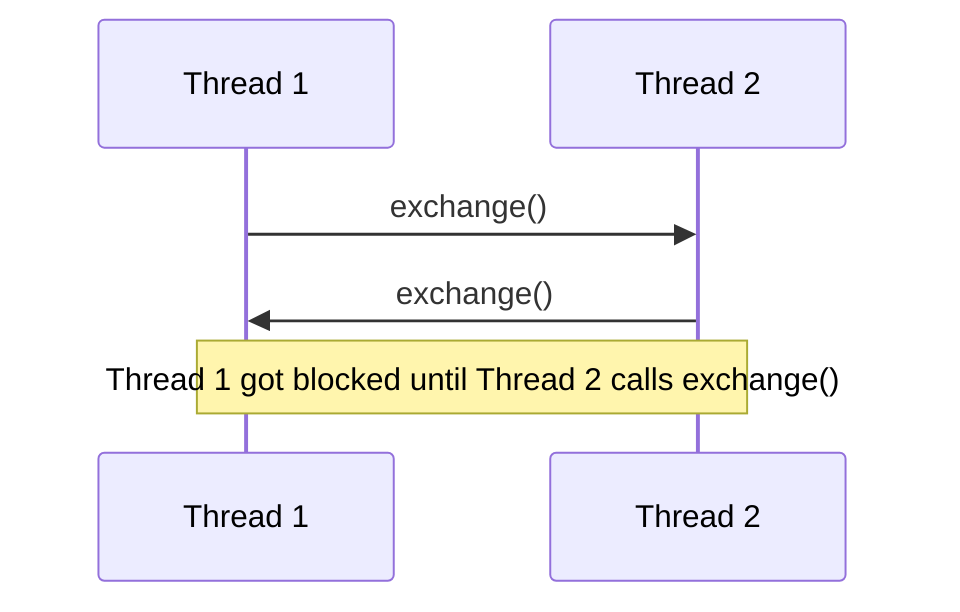
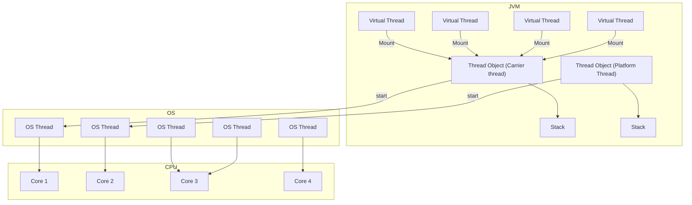

1. Process - an instance of a program execution.
    > Stack memory, heap memory, registers
2. Thread - an instance of a process execution.

## Terms
Concurrency (multitasking) - multiple tasks are making progress simultaneously
> [!Note]
> Don't need multiple CPUs to achieve concurrency.

Parallelism - multiple tasks are executed simultaneously on multiple CPUs.


## Context switch
- Trashing - spending more time switching between tasks than actually performing them.
- Epoch - a time period in which a process is executed.
> Dynamic priority = static priority + bonus

## Time slicing algorithm
Multiple processes are executed by the CPU in a round-robin fashion. 
Each process is given a small-time slice to execute. 
If the process doesn't complete within the time slice, 
the CPU is preempted and the next process is executed.

## Cost 
- Context switching
- Synchronization
- Deadlock
- Debugging and testing

## Lifecycles
- new
- active
  - running (CPU)
  - runnable (waiting for CPU)
- waiting
- terminated

## Races
### Race condition
### [Data race](src/first/DataRace.java)
The compiler reorders the instructions to optimize the performance.
- branch predictions (loops, if-else)
- vectorization (SIMD) - parallel instruction execution
- prefetching (caching) instructions
- better hardware cpu utilization (if a given alu is not available, the next instruction can be executed)

Order of the instructions might be prevented from being reordered by using `volatile`,
so all the instructions that are before the `volatile` variable are executed before the `volatile` variable, and vice-versa.

## [Java Thread](src/first/First.java)
- Extending the Thread class (Thread implements Runnable)
- Implementing the Runnable interface

## Daemon Thread & Worker Thread
- Main thread with child threads (worker threads)
- Daemon thread is a low priority thread that runs in the background to perform tasks such as garbage collection.
  > Daemon threads are terminated by the JVM when there are no other non-daemon threads running.

## Thread Priority
- Scheduler uses the priority of a thread to decide which thread to execute.
- [0..10], 5 is the default priority.


## Memory Management
Unlike processes, threads share the same address space in heap memory.


### [Synchronization](src/second_inter_thread_communication/Second.java)
#### Non-atomic operations
1. Read the value of the variable from memory to a register.
2. Modify the value in the register.
3. Write the value back to memory.

#### [Intrinsic Lock (Monitor Lock)](src/second_inter_thread_communication/RaceCondition.java)
- Every object or class has a single intrinsic lock associated with it.
- A thread that needs exclusive and consistent access to an object's fields has to acquire the object's intrinsic lock before accessing them, and then release the lock when it's done with them.
  > [!Note] 
  > The object of A has only 1 Intrinsic Lock, so only 1 thread can access the synchronized method of A at a time even if the methods are different.
```java
class A {
  synchronized void foo() { /*...*/ }

  synchronized void bar() { /*...*/ }
}

// Better approach as synchronized only the necessary part
class A1 {
  // Object level lock
  void foo() {
    synchronized (this) { /*...*/ }
  }

  // Class level lock
  static void bar() {
    synchronized (A1.class) { /*...*/ }
  }
}

// Solution for the above problem
class A2 {
  private final Object lock1 = new Object();
  private final Object lock2 = new Object();

  void foo() {
    synchronized (lock1) { /*...*/ }
  }

  void bar() {
    synchronized (lock2) { /*...*/ }
  }
}
```
#### [RLock (Re-entrant Lock)](src/second_inter_thread_communication/RLock.java)
- A thread can acquire the same lock multiple times.
- The lock is released when the thread has exited from all the synchronized blocks.
    > If a thread acquires the lock 3 times (e.g. recursive call), there won't be any deadlock, 
    but it needs to call unlock 3 times as well.

#### Thread communication
- wait(), notify(), notifyAll()
  > [!Note]
  > - `wait()` is called on the object, `sleep()` is called on the thread.
  > - `wait()` releases the lock, `sleep()` doesn't release the lock.
  > - `wait()` is used only in `syncronized` block, `sleep()` can be used anywhere.

```java
class A {
  private final Object lock = new Object();

  void foo() {
    synchronized (lock) {
      while (condition) {
        lock.wait();
      }
    }
  }

  void bar() {
    synchronized (lock) {
      lock.notify();
    }
  }
}
```

#### Locks
- ReentrantLock(fairness)  
*ReentrantLock vs synchronized*
  - same behavior
  - allows to use fairness; synchronized blocks don't
  - whether the lock is held or not can be queried
  - get the list of threads waiting for the lock
  - `lock` and `unlock` from different methods
  - `lock.newCondition()` for thread communication (similar to `wait`, `notify`)
  - try-catch-finally block is required to avoid deadlock
  > fairness - the longest waiting thread gets the lock first.
- Reentrant Read write lock
  - allows multiple readers to read the resource at the same time, but only one writer can write the resource at a time.

The lock is making the app less performant,
all threads become as slow as the slowest thread.

Even if the thread has a priority, the lowest priority thread might be
preempted (scheduled out) so it won't be able to release the lock (**priority inversion**)


### Multithreading concepts
#### [Volatile Keyword](src/third_concepts/Volatile.java)

Usually threads are running on different CPUs and have their own cache.
To prevent the cache from being out of sync, the `volatile` keyword is used.
So, the variable is always read from the main memory and not from the cache.

The variable isn't marked as `volatile`:
1. might be stored on main memory without `volatile` (even if it's not reference typed)
2. both of the threads might use the same cache.
Therefore, it might work without `volatile` but it's not guaranteed.

To sum up, with `volatile` we can safely either read or write, but not both.

#### [Deadlock](src/third_concepts/Deadlock.java)
- A situation where a set of processes are blocked 
because each process is holding a resource 
and waiting for another resource acquired by some other process.

##### Conditions
- Mutual Exclusion (only 1 thread can have exclusive access to a resource)
- Hold and Wait (a thread can hold a resource and wait for another resource)
- Non-preemptive allocation (a resource is released only after the thread has completed its task) 
- Circular wait (a set of threads are waiting for each other in a circular chain)
  > Solution: use the same order of acquiring the resources.

Watchdog - a thread that monitors the deadlock and kills the threads that are deadlocked.

#### LiveLock
Threads are not blocked, but each thread acts to a response 
to the action of another thread and vice-versa.
- too busy responding to each other to resume work.

#### Atomic Operations
- An operation that is performed as a single unit of work without the possibility of interference from other operations.
- Assigning/Reading reference variables and primitive variables (except long and double) are atomic operations.
  > Long and double are 64-bit, so they might be read or written in 2 steps.  
  > `volatile` keyword is used to prevent this. ???only for 64-bits???

AtomicInteger, AtomicReference, etc.

#### Semaphores & Mutexes (Mutual Exclusion Object)
##### [Semaphores](src/third_concepts/MySemaphore.java)
- A signalling mechanism. `wait()` and `notify()`  
- It allows multiple threads to access a finite instance of resource.  
- The thread is blocked if no resource is available.
- Has no `ownership` concept, meaning any thread can release the resource.
###### Types
- Counting
- Binary (can be used as a mutex, however it has no re-entrant effect)
##### Mutex
- A lock that is used to protect a shared resource.  
- It allows only **one** thread at a time to access a resource.  
- The thread is blocked if the resource is already locked.

### Executors
- A framework for creating and managing threads.
- Thread pools

#### Types
- SingleThreadExecutor
  > Every task is executed sequentially in a new thread.
- FixedThreadPool
  >A fixed number of threads are created and reused. 
  > 
  > usually it is the number of available processors,
if the number is greater than stored in LinkedBlockingQueue
- CachedThreadPool
  > A new thread is created if no thread is available.  
  - If a thread is idle for 60 seconds, it's terminated.
  - short-lived tasks
- ScheduledExecutor
  > Executes tasks after a given delay or at regular intervals.

### Runnable vs Callable
- Runnable doesn't return a result or throw an exception.
- Callable<T> returns a result and throws an exception.
  > Returns a `Future<T>` object.
```java
class MyCallable implements Callable<String> {
  @Override
  public String call() throws Exception {
    throw new Exception("Exception");
    return "Hello";
  }
}

class Main {
  public static void main(String[] args) {
    ExecutorService executor = Executors.newFixedThreadPool(1);
    Future<String> future = executor.submit(new MyCallable());
    try {
      System.out.println(future.get());
    } catch (Exception e) {
      e.printStackTrace();
    }
  }
}
```

### Collections
#### [Collections class](src/fourth_collections/Fourth.java)
Uses Intrinsic Lock, so even if the operations are different, the thread needs to wait.

```java
import java.util.Collections;

// Intrinsic lock: 
// needs to wait even if the operations are different
var list = Collections.synchronizedList(new ArrayList<>());
```

#### [Latch](src/fourth_collections/Fourth.java)
A synchronization aid that allows one or more threads to wait until 
a set of operations being performed in other threads completes.

#### [Cyclic barrier](src/fourth_collections/Fourth.java)
A synchronization aid that allows a set of threads to 
all wait for each other to reach a common barrier point.

#### Blocking, Delay, Priority Blocking queues
#### Concurrent Map
#### Exchanger


### Blocking IO
- A thread is blocked until the operation such as reading a file, querying a database is completed.
Application which uses more time for IO is called IO bound application.  
CPU is not involved in IO operations, so it's idle.  

#### Solutions
##### Thread-per-connection
- A new thread is created for each connection.
- The number of threads can't be indefinitely increased (and might cause crash).
- The context switch is expensive.
- Threadshing - a situation where the most of the CPU is spent on the OS managing the system threads.
 
##### Non-blocking IO

### Virtual threads
